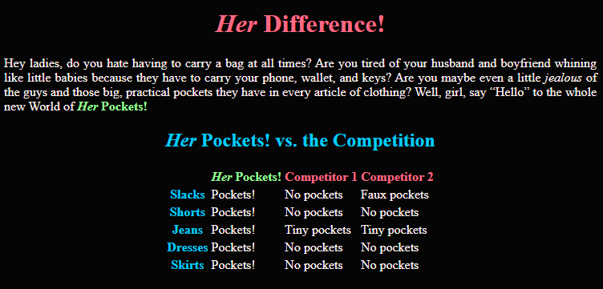

# Day 1 Walkthrough

This is a complete, step-by-step walkthrough for the Day 1 task. The first time that an HTML element or CSS property is mentioned, it will be explicitly added in the text. Subsequent mentions may be less straight forward, so do your best and don't be afraid to look back for the earlier explanations.

## HTML

Start by editing [/src/day1/difference.html](../../src/day1/difference.html) to fill in the structure and text of the **_Her_ Difference!** page.

1. Inside the HTML document body (`<body>`), add a level-one heading (`<h1>`) with the text "Her Difference!"
1. Add italics to the word "Her" in the heading with an emphasis element (`<em>`)
1. Beneath the heading, add a paragraph element (`<p>`) with the text "Hey ladies, do you hate having to carry a bag at all times? Are you tired of your husband and boyfriend whining like little babies because they have to carry your phone, wallet, and keys? Are you maybe even a little jealous of the guys and those big, practical pockets they have in every article of clothing? Well, girl, say “Hello” to the whole new World of Her Pockets!"
1. _Italicize_ the words "jealous" and "Her" in the paragraph by wrapping them in emphasis elements
1. **Bold** to the words "Her Pockets!" in the paragraph using a strong element (`<strong>`)
1. Beneath the paragraph, add a level-2 heading (`<h2>`), including the text "Her Pockets! vs. the Competition"
1. Inside the second heading, _italicize_ the word "Her"
1. Following the second heading, add a table element (`<table>`)
1. Add a table header to the table

   1. Inside the table, add a table head element (`<thead>`)
   1. Inside the table head, add a table row element (`<tr>`)
   1. Inside the table row, add four table header elements (`<th>`)
   1. Enter the following text in the table headers (in order from left to right)
      - _(leave text blank)_
      - _Her_ Pockets!
      - Competitor 1
      - Competitor 2
   1. Don't forget to _italicize_ "Her"

1. Add a table body to the table

   1. Inside the table element, following the table head, add a table body element (`<tbody>`)
   1. Add five table rows inside the table body
   1. Inside each row element, add one table header and three table data elements (`<td>`)
   1. Add a `scope` property to each of the five table headers with a value of `row`
   1. Add the following text to the row header elements (in order from top to bottom)

      - Slacks
      - Shorts
      - Jeans
      - Dresses
      - Skirts

   1. Add the text "Pockets!" to the first table data element in each row
   1. Add the following text to the second table data elements in each row (in order from top to bottom)

      - No pockets
      - No pockets
      - Tiny pockets
      - No pockets
      - No pockets

   1. Add the following text to the third table data elements in each row (in order from top to bottom)

      - Faux pockets
      - No pockets
      - Tiny pockets
      - No pockets
      - No pockets

Wow, that looks great! Well, not yet, it's kind of boring. But the bones are good.

## CSS

Now let's add some styling to make this site really pop, **_Her_ Pockets!** style! Open the [/src/day1/style.css](../../src/day1/style.css)

1. Set the foreground and background colors for the entire page
   1. Add a ruleset for the `body` selector
   1. Set the background color (`background-color` property) to `#050505`
   1. Set the foreground color (`color` property) to `#fff0f0`
      ```css
      body {
        background-color: #050505;
        color: #fff0f0;
      }
      ```
1. Set the color and alignment of the main page heading

   1. Add a ruleset for the `h1` selector
   1. Set the text alignment (`text-align` property) to `center`
   1. Set the foreground color to `#ff6A83`

      ```css
      h1 {
        text-align: center;
        color: #ff6a83;
      }
      ```

1. Set the color and alignment of the second level heading

   1. Add a ruleset for the `h2` selector
   1. Set the text alignment to `center`
   1. Set the foreground color to `#00CEFF`

1. Set the alignment of text paragraphs

   1. Add a ruleset for the `p` selector
   1. Set the text alignment to `justify`

1. Center the table on the page
   1. Add a ruleset for the `table` selector
   1. Set the margin (`margin` property) to `auto`
      ```css
      table {
        margin: auto;
      }
      ```
1. Add the final pops of **_Her_ Pockets!** color! We'll start by defining class selectors for each of the Brand colors, then circle back to the HTML file to add these classes to the appropriate elements

   1. Add a ruleset for the `her-red` class (`.her-red`)
   1. Set the foreground color to `#FF6A83`
   1. Add a ruleset for the `her-green` class (`.her-green`)
   1. Set the foreground color to `#98FF98`
   1. Add a ruleset for the `her-blue` class (`.her-blue`)
   1. Set the foreground color to `#00CEFF`

      ```css
      .her-red {
        color: #ff6a83;
      }

      .her-green {
        color: #98ff98;
      }

      .her-blue {
        color: #00ceff;
      }
      ```

1. Return to the [/src/day1/difference.html](../../src/day1/difference.html) file to add the classes from the previous step to the appropriate elements
   1. Add a `class` attribute with a value of `her-red` to the table row (`<tr>`) inside the table head (`<thead>`) element (`<tr class="her-red">`)
   1. Add a `class` attribute with a value of `her-green` to the strong element around "_Her_ Pockets!" in the paragraph (`<strong class="her-green">`)
   1. Add a `her-green` class attribute to the second table header element in the table head row
   1. Add a `her-blue` class attribute to each table header element in the table body (`<tbody>`)

Well, that's a pretty good start. Not bad for your first day! See you tomorrow, kid.

# Completed Page


